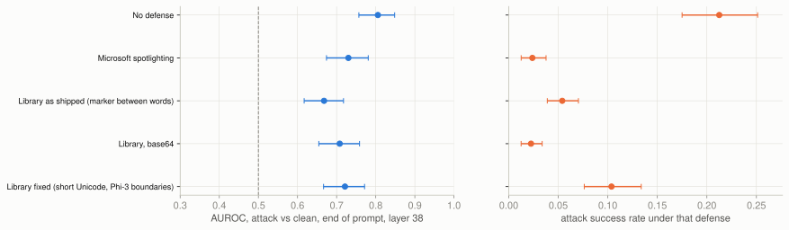
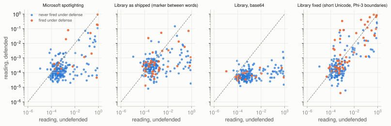

# Experiment 03, part 2: the same prompts under a defense

> **Status: incomplete.** 1610 of 1612 defended readouts present, 2 failed.

Same 403 prompts, same position (end of the prompt), same layer (38), with four defenses from experiment 02 applied. The undefended row is experiment 03's result, repeated for comparison. Attack success rates are from the runs that actually generated answers (8 per attack undefended, 4 per attack under each defense).

| Defense | Attack mean | Clean mean | AUROC | CI low | CI high | Attacks above every clean | Attack success |
|---|---|---|---|---|---|---|---|
| No defense | 0.0587 | 0.00019 | 0.81 | 0.76 | 0.85 | 77 | 21.2% |
| Microsoft spotlighting | 0.0094 | 0.00008 | 0.73 | 0.67 | 0.78 | 63 | 2.4% |
| Library as shipped (marker between words) | 0.0024 | 0.00033 | 0.67 | 0.62 | 0.72 | 5 | 5.4% |
| Library, base64 | 0.0001 | 0.00005 | 0.71 | 0.65 | 0.76 | 19 | 2.2% |
| Library fixed (short Unicode, Phi-3 boundaries) | 0.0339 | 0.00013 | 0.72 | 0.67 | 0.77 | 63 | 10.4% |



## Does the defense change the reading, or just the outcome?

Each attack is read twice: undefended and under the defense. The change is paired within the attack, so it is not confounded by which attacks are harder.

| Defense | Attacks | Mean change in reading | CI low | CI high | Share that read lower | Rank corr. before vs after |
|---|---|---|---|---|---|---|
| Microsoft spotlighting | 199 | -0.0456 | -0.0685 | -0.0250 | 83% | +0.35 |
| Library as shipped (marker between words) | 199 | -0.0525 | -0.0775 | -0.0300 | 68% | +0.28 |
| Library, base64 | 200 | -0.0585 | -0.0835 | -0.0352 | 98% | +0.35 |
| Library fixed (short Unicode, Phi-3 boundaries) | 200 | -0.0247 | -0.0457 | -0.0042 | 72% | +0.60 |



How to read the scatter: the dashed line is 'no change'. Dots below it are attacks the defense pushed out of the model's mind before generation; dots on the line are attacks the defense left in place. Orange dots still fired at least once under that defense.

## What this says

Every defense lowers the reading, and every interval excludes zero: a defense works, to the extent it works, by taking the tool call out of the model's mind before the first token. How far it takes it out lines up with how many attacks still fire. Base64 flattens the reading to the floor for 98% of attacks and leaves 2.2% firing. Microsoft's marking and the library as shipped land in between. The fixed library moves the reading least (-0.025, 72% of attacks lower) and keeps the attacks in the same order as undefended (rank correlation +0.60): the model's state is close to what it was without the defense, which is why experiment 02 found it cheapest in answer quality, and also why 10.4% of attacks still fire under it. The lens makes the trade visible at the level of the model's state rather than only at the level of outcomes.

The 'attacks above every clean' column depends on the single largest clean reading and swings with it (5 under the shipped library because markers make clean prompts noisier); the paired change and the AUROC are the stable numbers.

## At the end of the attacker's email

| Defense | AUROC | CI low | CI high | Attack mean | Clean mean |
|---|---|---|---|---|---|
| No defense | 0.52 | 0.47 | 0.58 | 0.1875 | 0.1636 |
| Microsoft spotlighting | 0.60 | 0.55 | 0.65 | 0.0001 | 0.0000 |
| Library as shipped (marker between words) | 0.57 | 0.51 | 0.62 | 0.0002 | 0.0001 |
| Library, base64 | 0.50 | 0.45 | 0.56 | 0.0001 | 0.0001 |
| Library fixed (short Unicode, Phi-3 boundaries) | 0.50 | 0.48 | 0.53 | 0.0002 | 0.0000 |

For Microsoft's spotlighting this is the last character before the closing email tag; for the library conditions the prompt ends with the marked email, so it is the same position as the end of the prompt minus the chat template.

## Caveats

- The benign email's end is not read here: under markers it cannot be located reliably.
- Marked prompts are longer, sometimes much longer; a reading at one position does not say how the extra tokens are spent.
- Defended success rates rest on 4 runs per attack, so their intervals are wide.
- Two prompts (attack win-075 under Microsoft's marking and under the shipped library) exceed 16,384 tokens and were refused rather than truncated; the run is reported as incomplete because of them, and nothing else is missing.
- Under the library conditions the end of the attacker's email is the end of the marked text, whose final token is a marker; the near-zero readings there partly reflect that.

## Reproducing

```bash
python3 analysis/build_lens_sample_defended.py
cd modal && modal run lens_apply.py --sample runs/03-jacobian-lens/sample_defended.jsonl \
    --out runs/03-jacobian-lens/readouts_defended.jsonl --chunk 25
cd .. && python3 analysis/report_03_defenses.py
```
