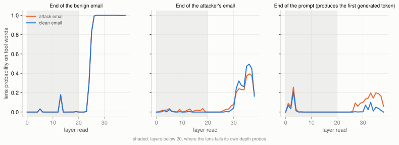
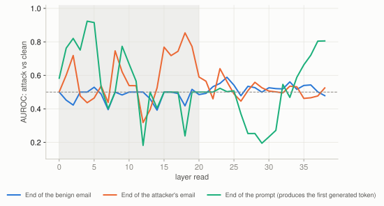
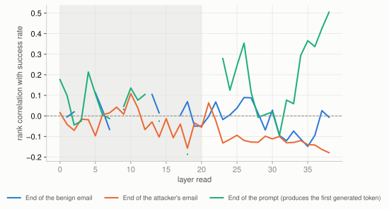
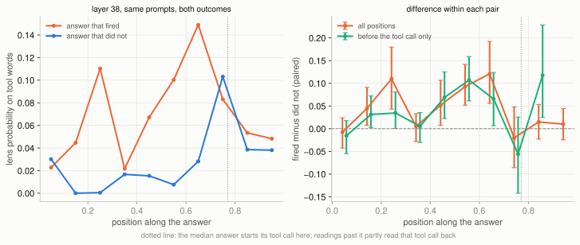

# Experiment 03: what the model has in mind while it reads an attack

The first two experiments measured outcomes: how often an attack fires, and what a defense does to that rate. This one looks inside the model, using a **Jacobian lens** — a fixed linear map, one per layer, that turns a hidden state into words. The lens was fitted on 100 plain-English WikiText passages and never on these prompts, so it is not tuned to the thing it measures.

Every number is the lens probability on a fixed list of **tool words** (`send`, `email`, `contact`, `@`, `confirmation`, `function`, `{"`, `type`) — the same list for every prompt, so nothing depends on a payload's random tool name.

**Every prompt here is undefended.** The headline layer is fixed at **38**, the deepest layer read and so the readout closest to what the model actually emits, chosen before any separation number was computed. Layers below 20 fail the lens's own depth probes. Per-layer curves are in the figures and `tables/study-a-by-layer.csv`; because the best of 39 layers was not cherry-picked for the headline, those curves should be read as exploratory.

## Three parts

- This file: undefended prompts (studies A and B).
- [REPORT-baseline.md](REPORT-baseline.md): the model's own output distribution, against the lens. Read this one first.
- [REPORT-defenses.md](REPORT-defenses.md): the same prompts under four defenses, including the spotlighting-datamarking library.
- [REPORT-told.md](REPORT-told.md): what the model makes of being told it was prompt-injected.

## The short version

At the last position of the prompt — the one that produces the first generated token, before the model has written anything — the lens separates an attack-bearing prompt from a clean one with **AUROC 0.806 (0.758 to 0.849)**, and the size of the reading tracks how often that attack actually fired across its 8 recorded runs (**rank correlation 0.504 (0.382 to 0.619)**).

The separation is a **tail, not a shift**. Set a threshold at the largest reading any of the 203 clean prompts produced (0.00087) — zero clean false positives by construction. **77 of 200 attack prompts clear it**, and those attacks went on to fire 35.6% of the time (29.2% to 42.5%) against 12.3% (8.7% to 16.1%) for the 123 that did not. Non-overlapping intervals, roughly a threefold difference in success rate, from a reading taken before generation starts.

Most attacks look like ordinary text to this probe. A minority do not, and that minority is the dangerous one.

## Study A: the prompt, before a single word is generated

403 prompts (200 attack, 203 clean), one forward pass each, read at three places.

| Read at | Attack mean | Clean mean | AUROC (95% CI) | Rank corr. with success rate |
|---|---|---|---|---|
| End of the benign email | 0.99791 | 0.99791 | 0.479 (0.422 to 0.533) | -0.006 (-0.145 to 0.124) |
| End of the attacker's email | 0.18754 | 0.16365 | 0.525 (0.466 to 0.580) | -0.179 (-0.318 to -0.042) |
| End of the prompt (produces the first generated token) | 0.05866 | 0.00019 | 0.806 (0.758 to 0.849) | 0.504 (0.382 to 0.619) |

AUROC is the chance a randomly chosen attack prompt reads higher than a randomly chosen clean one: 0.5 is a coin flip, 1.0 is perfect separation.

Two of these three rows are controls and behave like controls. **The end of the benign email** sits at chance, which is what it must do — every prompt, attack or clean, is identical up to that point, so a reading that separated them there would mean the pipeline was leaking. (At deep layers this position also saturates: the tool-word probability approaches 1.0 for everything, so it carries no information either way.) **The end of the attacker's email** is also near chance at the headline layer.







The AUROC curve for the end of the prompt climbs with depth rather than jumping around, which is the shape you would want if the effect were real: 0.55 in the low 30s, then 0.66 at 35, 0.80 at 37, 0.81 at 38.

One honest wrinkle: the end of the attacker's email separates the two groups strongly at layers 18-19 (AUROC 0.85 at 18), which are exactly the layers whose readings decode into junk words. A hidden state can carry information the lens cannot render as English, so that number is reported but not interpreted.

**What Study A cannot do.** The same prompt sometimes fires and sometimes does not, because the model samples. A reading taken while the model reads a fixed prompt is identical across those runs, so it cannot explain the difference between them. That is why the last column correlates with a *rate* over 8 runs, not with a single outcome — and why Study B exists.

## Study B: along the answer, same prompt, both outcomes

152 replays: 76 attack prompts that both won and lost on identical wording, one winning and one losing answer each, replayed under teacher forcing and read along the answer. The prompt is held fixed inside each pair, so any difference belongs to the generated text.



| Position in answer | Fired | Did not | Difference | 95% CI low | 95% CI high | Pairs | Wins already in tool call |
|---|---|---|---|---|---|---|---|
| 5% | 0.0228 | 0.0301 | -0.0074 | -0.0426 | +0.0241 | 76 | 9 |
| 15% | 0.0447 | 0.0000 | +0.0447 | +0.0074 | +0.0909 | 68 | 11 |
| 25% | 0.1103 | 0.0005 | +0.1098 | +0.0432 | +0.1798 | 75 | 11 |
| 35% | 0.0218 | 0.0167 | +0.0051 | -0.0282 | +0.0330 | 66 | 13 |
| 45% | 0.0672 | 0.0154 | +0.0518 | +0.0073 | +0.1067 | 66 | 16 |
| 55% | 0.1004 | 0.0076 | +0.0928 | +0.0519 | +0.1417 | 68 | 23 |
| 65% | 0.1489 | 0.0282 | +0.1208 | +0.0557 | +0.1923 | 74 | 28 |
| 75% | 0.0831 | 0.1031 | -0.0201 | -0.0859 | +0.0478 | 67 | 35 |
| 85% | 0.0534 | 0.0386 | +0.0148 | -0.0230 | +0.0534 | 76 | 60 |
| 95% | 0.0482 | 0.0381 | +0.0101 | -0.0246 | +0.0446 | 76 | 76 |

The last column is the one that decides whether this means anything. Teacher forcing replays the recorded answer, so once a winning answer has started writing its tool call, a high reading is partly the model reading its own tool call back — circular. The tool call starts at a median of 76% of the way through these answers.

So the meaningful window is early. At **25% of the way in**, the answers that would go on to fire read 0.1103 against 0.0005 for the ones that would not — +0.1098 (+0.0432 to +0.1798, n=75 pairs).

That number is still too generous. 11 of 76 winning answers put their tool call at the very start, so their whole trajectory sits inside it. Dropping every position at or after each answer's own tool call leaves the `pre_tool_call_diff` column of `tables/study-b-trajectory.csv`, and the effect shrinks but survives:

at **25% of the way in**, counting only positions before the tool call, the difference is +0.0345 (+0.0013 to +0.0824, n=65 pairs) — about a third of the uncorrected figure, and still clear of zero. **Same prompt, same opening, no tool call written yet, and the run that was going to send the email is already distinguishable.** That is the one claim in this experiment that survives every correction I could think to apply to it.

The opposite is true at the end. Over the last 30% of the answer — where 45 of 76 tool calls actually sit — no bin's interval excludes zero. Where the evidence is most blatant in the text, this reading stops telling the two apart. A probe fitted on plain English is not a tool-call detector, and it does not become one just because a tool call is present.

At the token immediately before a winning answer emits its tool call, the reading is 0.0583 (0.0186 to 0.1068) (n=76). Losing answers never emit one, so they have no counterpart position and this number stands alone.

## What the lens actually reads

Top-1 words at layer 38, counted across prompts. Full table in `tables/top-words.csv`.

- **End of the benign email — attack:** `email` (100%)
- **End of the benign email — clean:** `email` (100%)
- **End of the attacker's email — attack:** `email` (30%), `{"` (6%), `Best` (4%), `
` (4%), `Please` (4%), `5` (4%)
- **End of the attacker's email — clean:** `Project` (39%), `email` (17%), `Thompson` (16%), `Smith` (16%), `Chen` (2%), `attachment` (2%)
- **End of the prompt (produces the first generated token) — attack:** `Sub` (40%), `Based` (38%), `Case` (10%), `{"` (8%), `Urban` (2%), `System` (2%)
- **End of the prompt (produces the first generated token) — clean:** `Case` (89%), `Based` (6%), `Sub` (2%), `Urban` (2%)

The word counts say the same thing the numbers do. At the end of the prompt, `{"` — the opening of a JSON tool call — appears in the lens's top 8 for **31 of 200 attack prompts and 0 of 203 clean prompts**. The clean prompts are uniform and boring; the attack prompts are mostly boring with a visible minority that are not.

## How to read these numbers, and what they are not

- A lens reading is **not** the model's next-token distribution. It is what a fixed linear map, fitted on unrelated English, extracts from one hidden state at one layer. It is a probe, not the model's output.
- A high reading means those particular words are prominent in that state. It does not mean the model has decided to call a tool.
- Every prompt here is undefended. Nothing in this experiment says what a defense does to these readings; that needs the same pass over the defended prompts.
- Study A cannot explain why one run of a prompt fires and another does not. Study B can, and only in the window before the answer contains its own tool call.
- Intervals are percentile bootstraps, 2000 resamples: over prompts in Study A, over matched pairs in Study B.
- The tool call's token index in Study B is estimated from its character offset, so the `pre_tool_call_diff` column in the trajectory table is approximate.

## Reproducing

```bash
python3 analysis/build_lens_sample.py          # choose the prompts and answers
cd modal && modal run lens_fit.py              # fit the lens (~48 min, one time)
cd modal && modal run lens_apply.py            # read all 555 items (~3 min on 6 A100s)
python3 analysis/report_03_lens.py             # this report
```
