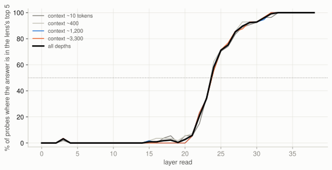

# Experiment 07: where the lens becomes readable on Phi-3

**222 probes** — 30 facts, two framings each, four context depths, two independently fitted lenses — asking at every layer whether the lens puts the correct answer in its top five words.

This exists because an earlier draft claimed the lens decodes "from about layer 20" on the strength of five layers probed with two facts. That was not enough to support a claim about the shape of anything.

## The answer

- Below layer 21 the lens is **unreadable**: never above 6%, usually 0%.
- It turns on **sharply between layers 21 and 24** — 6%, 21%, 34%, 58%.
- It passes half at **layer 24** and is effectively perfect from **layer 32**.
- So of 40 layers, **15 carry reliably readable content**, and they are the last ones before the output.

| Layer | All depths | ~10 tokens | ~400 | ~1,200 | ~3,300 |
|---|---|---|---|---|---|
| 18 | 2% | 6% | 4% | 0% | 0% |
| 19 | 0% | 0% | 2% | 0% | 0% |
| 20 | 3% | 6% | 5% | 0% | 0% |
| 21 | 6% | 6% | 7% | 5% | 5% |
| 22 | 21% | 15% | 21% | 23% | 23% |
| 23 | 34% | 35% | 34% | 34% | 34% |
| 24 | 58% | 56% | 62% | 59% | 55% |
| 25 | 71% | 70% | 71% | 71% | 71% |
| 26 | 75% | 74% | 75% | 75% | 77% |
| 27 | 85% | 83% | 86% | 86% | 86% |
| 28 | 90% | 89% | 93% | 89% | 88% |
| 29 | 92% | 91% | 93% | 93% | 93% |
| 30 | 93% | 93% | 93% | 93% | 93% |
| 31 | 96% | 96% | 96% | 95% | 96% |
| 32 | 99% | 96% | 100% | 100% | 100% |
| 33 | 100% | 100% | 100% | 100% | 100% |
| 34 | 100% | 100% | 100% | 100% | 100% |
| 35 | 100% | 100% | 100% | 100% | 100% |
| 36 | 100% | 100% | 100% | 100% | 100% |
| 37 | 100% | 100% | 100% | 100% | 100% |
| 38 | 100% | 100% | 100% | 100% | 100% |



## Two things that could have broken this, and did not

- **Context length does not matter.** The largest gap between a ~10-token context and a ~3,300-token one, at any layer, is 8%. The lens does not degrade as the prompt grows, which is the failure mode I expected to find and did not.
- **The two lenses agree.** Fitted on disjoint WikiText, their largest disagreement at any layer is 13%, and from layer 30 up they are identical.

## What this implies for using a lens on a 14B model

The readable band sits against the output. By the time the state decodes into words, the model is a few layers from saying them — so there is little room for a lens to tell you something the model's own next-token distribution will not. That is a structural reason, not a complaint about the method, and it is consistent with what the rest of this project found: the output beat the lens at every detection task (`results/03-jacobian-lens/REPORT-baseline.md`).

Whether a larger model has a wider readable band is exactly the experiment this does not do.

## Scoring, and a bug worth naming

The first version of this probe scored the answer by its **leading token id**. Phi-3's tokenizer splits digits, so every numeric answer — and `yen`, `mice` — was scored against a token that decodes to the empty string. That manufactured a signal of 14-20% at layers 1-5, which does not exist. This version scores on the decoded top-five words.

It also keeps only probes where the **model's own** top five contains the literal answer, so the lens is never asked for something the model does not know: 222 of 480 runs. Dropped answers were mostly multi-token words: 12, 15, 3, 5, 64, 7, 8, Everest….

## Limits

- Known-answer factual recall only. A layer could carry information the lens cannot render as words; this measures the readout, not the representation.
- Top-5 is an arbitrary cutoff. `tables/readability-by-layer.csv` carries the per-depth and per-lens numbers; the raw file also holds exact ranks and probabilities.
- One model.

## Reproducing

```bash
cd modal && modal run lens_probe.py      # ~4 minutes, pennies
cd .. && python3 analysis/report_07_layers.py
```
